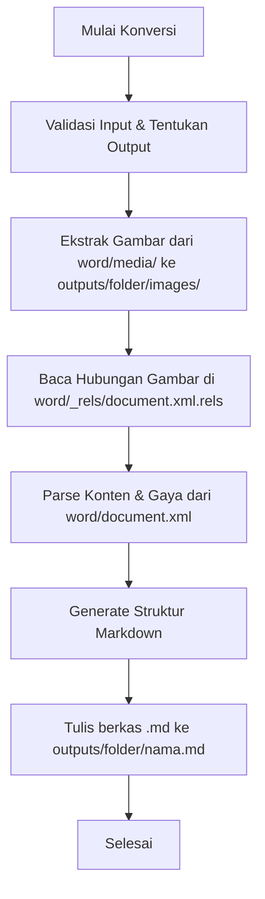

# Markdown Gokil (DOCX to MD Converter)

A robust Go-based utility to convert .docx documents into clean, structured Markdown (.md) files. Designed to preserve essential formatting from original documents.

## Key Features

- **Smart Text Conversion**: Converts paragraphs, bold, italic, and combined formatting.
- **Automatic Heading Detection**: Intelligently determines heading levels (#, ##, ###, ####) based on the original font size.
- **Table Support**: Automatically converts DOCX tables into clean Markdown table format.
- **List and Sub-list Handling**: Supports numbered lists (1, A, a, i) and bullet points with proper hierarchical (sub-list) support.
- **Image Extraction**: Automatically extracts images from the original document and saves them to an 'images' folder in the output directory with correct markdown links.
- **Organized Output Structure**: Each conversion creates a dedicated folder to keep markdown files and images organized.

## Project Structure

- `cmd/markdown-gokil/`: CLI entry point.
- `internal/docx/`: DOCX XML parsing logic, table, and numbering handling.
- `internal/converter/`: Conversion orchestration and output folder management.
- `internal/markdown/`: Writer for generating clean Markdown syntax.

## Installation

Ensure you have Go installed on your system.

```bash
go build -o build/markdown-gokil ./cmd/markdown-gokil/main.go
```

## Usage

Run the following command to convert a document:

```bash
# Otomatis membuat output berdasarkan nama file (misal: outputs/input/input.md)
./build/markdown-gokil input.docx

# Dengan folder output spesifik
./build/markdown-gokil input.docx hasil
```

The conversion output will be structured as a folder containing the `.md` file and its extracted images.

### Struktur Output & Ekstraksi Gambar

Jika dokumen `.docx` memiliki gambar, gambar tersebut akan diekstraksi secara otomatis ke folder `images` di dalam folder output:
`outputs/<nama_output>/images/`

**Contoh Struktur Output:**
Jika Anda menjalankan perintah:
```bash
./build/markdown-gokil contoh.docx
```
Maka struktur folder yang dihasilkan adalah:
```text
outputs/contoh/
├── contoh.md
└── images/
    ├── image1.png
    └── image2.jpeg
```
Di dalam file `contoh.md`, gambar akan otomatis dirujuk menggunakan path relatif: ``.

## Alur Kerja (Workflow) Konversi

Proses konversi dari berkas `.docx` menjadi berkas Markdown (`.md`) bekerja dengan langkah-langkah berikut:



1. **Validasi & Penentuan Output**: Memastikan file input berformat `.docx` dan menentukan nama folder output di bawah direktori `outputs/`.
2. **Ekstraksi Gambar (Media)**: Karena berkas `.docx` sebenarnya adalah arsip ZIP, aplikasi mengekstrak semua aset gambar yang berada di dalam folder `word/media/` langsung ke folder tujuan `outputs/<nama_output>/images/`.
3. **Pemetaan Relasi (Relationships)**: Membaca berkas relasi internal `word/_rels/document.xml.rels` untuk memetakan ID gambar ke nama berkas gambar agar referensi gambar di dalam dokumen XML dapat dicocokkan dengan benar.
4. **Parsing Konten XML**: Membaca berkas utama `word/document.xml` untuk mem-parse paragraf, gaya teks (tebal, miring), list (bullet/numbered), tabel, dan mendeteksi heading berdasarkan ukuran font.
5. **Pembuatan Markdown**: Menerjemahkan semua node XML yang di-parse menjadi sintaks Markdown bersih dengan referensi path gambar yang sesuai (``).
6. **Penulisan Berkas**: Membuat folder tujuan dan menulis file `.md` akhir.

## MCP (Model Context Protocol) Support

This application can run as an MCP server, allowing AI agents (such as Claude Desktop, Cursor, Windsurf, etc.) to use it as a tool to convert `.docx` files into Markdown.

### Tool: `convert_docx`
- **Arguments:**
  - `inputPath` (string, required): The absolute or relative path to the input `.docx` file to convert.
  - `outputPath` (string, optional): The optional path where the markdown file will be saved. If omitted, saves in `outputs/<foldername>/<filename>.md`.

### Running the MCP Server
To start the MCP server over stdio:
```bash
./build/markdown-gokil -mcp
```
or via `just`:
```bash
just mcp
```

### AI Agent Integration Example

#### Claude Desktop
Add the following to your `claude_desktop_config.json` (usually located at `~/Library/Application Support/Claude/claude_desktop_config.json` on macOS):

```json
{
  "mcpServers": {
    "markdown-gokil": {
      "command": "/usr/local/bin/go",
      "args": [
        "run",
        "cmd/markdown-gokil/main.go",
        "-mcp"
      ],
      "cwd": "/Users/femasakbarfathurohim/Documents/Developments/GO/markdown-hebat"
    }
  }
}
```
> [!NOTE]
> Make sure to adjust the `command` (path to your `go` binary if not in path) and `cwd` (path to this project directory) in your config file.

## Development

This project uses Justfile (a modern alternative to Makefile) for task automation:

- `just build`: Compiles the application to `build/`.
- `just run <input.docx> [output_name]`: Runs the conversion directly.
- `just mcp`: Starts the MCP server over stdio.
- `just tidy`: Cleans up Go dependencies.
- `just clean`: Removes the build folder and binary.

## License
Created for fast and efficient document conversion.
